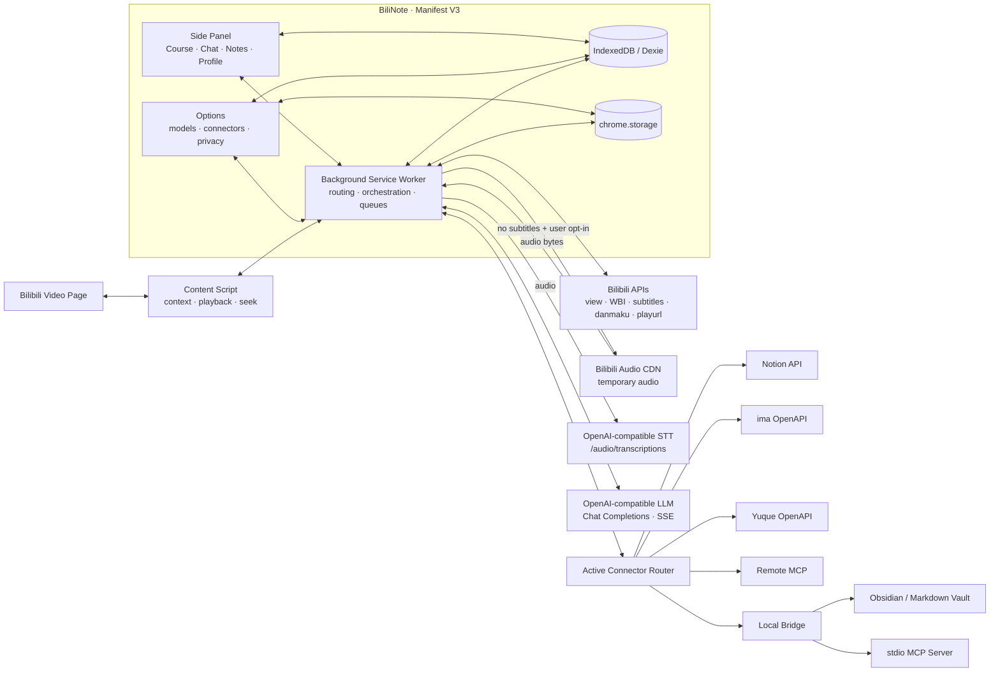
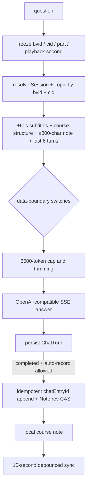

<div align="center">


# BiliNote

**Turn Bilibili videos into timestamped courses, conversations, and knowledge notes**

An open-source, local-first, BYOK browser extension. It prefers existing video subtitles, lets the user opt into speech-to-text when none are available, then uses your own model for course analysis and in-context Q&A while keeping Markdown notes locally or syncing them to your own knowledge base.

[](LICENSE)
[](https://wxt.dev/)
[](https://www.typescriptlang.org/)
[](https://developer.chrome.com/docs/extensions/develop/migrate/what-is-mv3)
[](https://github.com/AliceDel66/BiliNote/releases)
[](https://github.com/AliceDel66/BiliNote/stargazers)

[简体中文](README.md) · **English**

[Project sponsor: Token小铺](https://api.zgonline.top/) · [Free speech-to-text API: Groq](https://groq.com/)

[How it works](#how-it-works) · [Architecture](#system-architecture) · [Core flows](#core-flows) · [Sponsors and support](#sponsors-and-support) · [Data and privacy](#data-and-privacy) · [Quick start](#quick-start) · [Contributing](#contributing)

</div>

> [!IMPORTANT]
> BiliNote reads subtitles already provided by Bilibili by default and never downloads or uploads media automatically. Only when no subtitle is available and the user clicks “Use speech-to-text (Beta)” does the extension temporarily fetch the lowest-bitrate DASH audio for the current part, or fall back to an MP4 mixed stream when DASH is unavailable, and send that file to a user-configured OpenAI-compatible STT service. Phase 1 supports one file up to 25 MB and does not split longer media.

> [!NOTE]
> This document covers `v0.1.1` and the current `main`. Version `v0.1.1` is the first package to include Beta speech-to-text for videos without subtitles and adds the official Yuque OpenAPI connector. It remains a pre-alpha release intended for developers and early adopters.

## What is BiliNote?

BiliNote organizes video learning into four connected surfaces backed by the same local course data:

| Surface | Responsibility |
| --- | --- |
| **Course** | Detect the current video and part, read existing subtitles or run opt-in speech-to-text, and generate an outline, section summaries, key points, extensions, and caveats |
| **Chat** | Freeze the current playback position and answer with nearby subtitles, course structure, and a note excerpt; completed answers can be recorded into the course note |
| **Notes** | Edit and preview Markdown, preserve timestamps, and sync the local note to a selected knowledge base; the storage layer keeps recent versions |
| **Profile** | Compute learning totals, streaks, an activity heatmap, and course progress directly from local analysis, note, and Q&A records |

The project has no hosted application backend. Video context, notes, analysis caches, and chat history live in the browser. Model calls, speech-to-text, and knowledge-base writes go directly from the extension to services configured by the user.

## Sponsors and support

- **Project sponsor:** [Token小铺 AI API Gateway](https://api.zgonline.top/)
- **Free speech-to-text API:** [Groq](https://groq.com/) provides a GroqCloud Free tier that is free to start and supports the `/audio/transcriptions` protocol used by BiliNote. Quotas, rate limits, pricing, and model availability may change under Groq's current policy.

BiliNote does not bundle shared API keys or send requests to the sponsor or Groq by default. Users explicitly configure and authorize model and speech-to-text services and remain responsible for the applicable service terms.

## How it works

```mermaid
flowchart LR
    Video["Bilibili video page"] --> Context["video / part / playback position"]
    Context --> Subtitle{"usable subtitles?"}
    Subtitle -->|"yes"| Analyze["Map-Reduce course analysis"]
    Subtitle -->|"no, user opts in"| Audio["temporarily fetch lowest-bitrate audio"]
    Audio --> STT["OpenAI-compatible STT"]
    STT --> Analyze
    Analyze --> Course["outline / sections / key points / timestamps"]
    Course -->|"user saves as note"| Note["local Markdown note"]
    Context --> Chat["course-aware Q&A"]
    Course --> Chat
    Chat -->|"completed answer, reversible"| Note
    Note --> Local[("IndexedDB")]
    Note -->|"optional one-way sync"| Connector["knowledge connector"]
    Local --> Profile["local learning statistics"]
```



Core principles:

- **Local-first:** the local note is the source of truth; external knowledge-base copies are derived and replaceable;
- **BYOK:** users configure their own model and STT API keys, connector credentials, and write targets;
- **Context-aware:** analysis, Q&A, and notes are scoped by `bvid + cid`, while timestamps link back to the corresponding frame;
- **Adapter-based:** Notion, ima, MCP, and local Markdown implement the same write contract without becoming part of the core note model;
- **Auditable:** permissions, storage, network destinations, and failure paths are traceable in source.

## System architecture



### Runtime boundaries

| Boundary | Owns | Does not own |
| --- | --- | --- |
| [`entrypoints/content.ts`](entrypoints/content.ts) | Bilibili SPA route detection, current playback time, same-part and cross-part seeking | Cross-origin requests, model calls, persistence |
| [`entrypoints/sidepanel/`](entrypoints/sidepanel/) | Four user workspaces, streaming progress, Markdown editing, and learning statistics | Long-running task ownership or direct third-party API calls |
| [`entrypoints/options/`](entrypoints/options/) | Model profiles, connectors, data boundaries, export, and reset | Business-note persistence or analysis orchestration |
| [`entrypoints/background.ts`](entrypoints/background.ts) | Message routing, cross-origin requests, Analysis and Chat ports, opt-in audio download and STT, serialized sync, Service Worker recovery | UI state or the only copy of business data |
| [`lib/`](lib/) | Bilibili, LLM, Transcribe, Summarization, Chat, Storage, Connector, Notion, and Stats domain modules | UI layout or browser-page manipulation |
| [`scripts/bridge.mjs`](scripts/bridge.mjs) | A loopback-only Markdown Bridge and an HTTP adapter for stdio MCP | Cloud hosting, credential hosting, or remote access |

The Background Service Worker is the orchestration center for network and long-running work. The Content Script only touches the page; Side Panel and Options own interaction; Dexie and `chrome.storage` own persistence. This split aligns with MV3 lifecycle, Host Permission, and testability boundaries.

## Core flows

### 1. Video context, subtitles, and speech-to-text

1. The Content Script extracts `bvid` and the current part from the URL, observes Bilibili SPA route changes, and exposes playback-time and seek messages.
2. Background queries the active tab. If the page predates an extension reload, it first reinjects the Content Script and then falls back to URL parsing if injection still fails.
3. The Bilibili adapter calls the view API for `aid`, `cid`, title, cover, author, and parts, then updates the video record in Dexie.
4. Subtitle requests use WBI signing. Track priority is: human Chinese, any human track, any Chinese track, then the first available track.
5. Subtitle CDN JSON is normalized into `Cue[]` and reused for 24 hours by `bvid + cid`. Expiry is a TTL read rule: an expired row is ignored rather than physically deleted at the 24-hour boundary. Optional danmaku is supplemental; a danmaku failure does not block subtitle analysis.
6. Without subtitles, Background first emits `no-subtitle`. The user can keep the degraded state, retry subtitles, or explicitly choose “Use speech-to-text (Beta).” The STT path reads playurl, chooses the lowest-bitrate DASH audio, and falls back to the first `video/mp4` mixed stream when DASH audio is unavailable. It temporarily downloads and uploads that file to the configured STT service, then normalizes `verbose_json` segments into `Cue[]`.

The transcription is stored in the same subtitle cache with `source: stt` and the same 24-hour reuse TTL; audio or MP4 bytes are never written to IndexedDB. Size is checked before and after download. Phase 1 stops when the file exceeds 25 MB instead of truncating media or inventing subtitles.

### 2. Course analysis

```mermaid
sequenceDiagram
    actor User
    participant Panel as Side Panel
    participant BG as Background
    participant Store as IndexedDB
    participant Bili as Bilibili API
    participant STT as User STT
    participant Model as User LLM

    User->>Panel: Analyze
    Panel->>BG: ANALYZE_PORT { bvid, p }
    BG->>BG: resolve video and part identity
    opt 5-minute in-memory cache miss
        BG->>Bili: view metadata
    end
    BG->>Store: upsert video record
    BG->>Store: read AnalysisResult cache
    alt cache for the same model identity
        Store-->>BG: AnalysisResult
    else generation required
        BG->>Store: read subtitle cache
        alt subtitle cache miss
            BG->>Bili: subtitle tracks + subtitle JSON
            opt no subtitles + user selects Beta transcription
                BG->>Bili: playurl + lowest-bitrate audio
                BG->>STT: audio + model + verbose_json
                STT-->>BG: segments / text
            end
            BG->>Store: save normalized subtitles
        end
        BG->>Model: concurrent Map summaries
        BG->>Model: SSE Reduce pass
        BG->>BG: validate structure and timestamps; repair once
        BG->>Store: persist AnalysisResult first
    end
    BG-->>Panel: scoped progress / done
```

Analysis invariants:

- Cache identity includes `bvid + cid + profile name / model / baseURL`, so two same-named models on different services cannot share results accidentally.
- When subtitles exceed the budget, chunks use 60% of the context budget with roughly 30 seconds of overlap. Map concurrency is capped at 3.
- Reduce streams over SSE, allowing the UI to show stages and incremental output or cancel the task.
- Output is parsed into structured JSON and checked for valid sections and timestamps. One repair request is allowed; after that, raw Markdown is preserved.
- Background persists the result before emitting `done`. A cache write failure is not reported as success.
- Analysis results carry the subtitle source; the UI labels STT-backed output as “AI-transcribed subtitles.”
- Every event carries `bvid + cid + p`; the UI drops late events after the user switches videos.

### 3. In-context Q&A



- Every topic keeps a fixed playback anchor. The user can explicitly move the next question to the current playback position.
- Context completeness is `full`, `partial`, or `none`. If course-data sharing is disabled or subtitles are absent, the prompt must say that the instructor's words cannot be verified.
- Subtitles and note excerpts are wrapped as untrusted data, and forged boundary tags are neutralized. Summary parsing strips `<think>` blocks; Chat only removes recognizable long reasoning preambles as a fallback and does not guarantee filtering every reasoning trace.
- `clientRequestId` prevents duplicate generations after reconnects. `ChatTurn.id` also serves as `chatEntryId`, enabling targeted undo, skip, and re-record operations.
- Provider-native Web Search is enabled only for known-compatible endpoints. The current capability table includes the Moonshot/Kimi `$web_search` protocol loop; unknown providers do not receive speculative tools.
- Cancellation preserves any generated fragment but does not write a note. Answer generation and note-write failures are recorded independently.

### 4. Notes and synchronization

The local Markdown note is the system's only source of truth:

1. Course analysis can create a note with video metadata, the original URL, and timestamp anchors. Chat can also create or resolve the target note for the current `cid`.
2. The editor saves with a debounce. Every write increments `rev`, and the storage layer preserves the latest 10 content versions. The current UI does not yet provide version browsing or restoration.
3. Chat uses Compare-And-Swap (CAS) to append Q&A blocks. On concurrent manual edits, it reloads the latest note and replays the idempotent block for up to 3 attempts instead of silently overwriting.
4. A save enters the global serialized queue for the active connector. On Service Worker restart, stale `syncing` rows return to `pending` and are queued again.
5. Successful sync only clears the local `dirty` flag. Connector mappings store external document IDs and status; they never replace the note.

## Knowledge connectors

Connectors implement a shared `testConnection()` and `upsertCourseNote()` contract. Only one connector is the default write target at a time. The current direction is **BiliNote → external knowledge base**. External content is not pulled into Chat, and bidirectional sync is not promised.

| Preset | Transport and write semantics | Boundary |
| --- | --- | --- |
| **Notion** | Internal Integration Token; the user selects a root page, then the connector creates course and part pages beneath it; archives old blocks before replacing the page | Detects concurrent local and remote edits; not OAuth |
| **ima (Beta)** | Official OpenAPI; imports Markdown into the selected knowledge base, then appends only a new suffix | If a previously synced prefix changes and the API cannot replace a document, sync stops to avoid duplication or data loss |
| **Tencent Docs (Beta)** | Official Remote MCP with a raw `Authorization` token | Tool capabilities and arguments are mapped from endpoint discovery |
| **Feishu Docs (Beta)** | Personal Remote MCP URL; the URL itself contains the credential | Tool capabilities and arguments are mapped from endpoint discovery |
| **Custom Remote MCP** | Public HTTPS MCP using `initialize → tools/list → tools/call` | Statically rejects loopback, common literal private addresses, and plain HTTP; requests the exact origin permission |
| **Obsidian** | Local Markdown Bridge writing under `BiliNote/` in a Vault | Bridge binds only to `127.0.0.1`, requires a Bearer Token, and enforces root containment |
| **Yuque (Beta)** | Official OpenAPI; authenticates with a token, selects a target knowledge base, creates Markdown on first sync, and replaces the document on later syncs | Currently restricted to official `yuque.com` cloud hosts; a TOC failure keeps the document and allows manual organization in Yuque |

MCP writes infer `create`, `append`, or `update` from tool names and common argument names. Remote MCP presets are therefore adapters, not a guarantee that any MCP Server works without configuration.

## Data model

### IndexedDB: business data

The Dexie database is named `bilinote`:

| Table | Key / identity | Content |
| --- | --- | --- |
| `videos` | `bvid` | Video metadata, parts, first-seen and last-viewed times |
| `subtitles` | `bvid + cid` | Normalized cues, language, human / Bilibili AI / STT source, and cache time |
| `summaries` | `bvid + cid + modelId` | Structured course analysis and estimated input tokens |
| `notes` | Auto-increment ID | Markdown, template, source, `dirty`, `rev`, and timestamps |
| `noteVersions` | Auto-increment ID | The latest 10 content versions per note; storage only, with no restoration UI yet |
| `chatSessions` | `bvid + cid` | Course session and target note |
| `chatTopics` | Topic ID | Topic title and fixed playback anchor |
| `chatTurns` | Turn ID / `clientRequestId` | Question, answer, generation state, and note-write state |
| `notionMappings` | Note ID | Notion page tree, scope, conflict baseline, and sync status |
| `connectorSync` | Note ID + Connector ID | Non-Notion external document ID and sync status |

### chrome.storage: configuration

| Storage area | Content | Browser sync |
| --- | --- | --- |
| `chrome.storage.local` | Model profiles and API keys, speech-to-text baseURL / API key / model, Notion token, connector profiles and credentials | No |
| `chrome.storage.sync` | Theme, active model, context budget, analysis/Chat preferences, and data-boundary switches | May sync when browser sync is enabled |

Data export includes business tables and preferences. It excludes model API keys, speech-to-text API keys, Notion tokens, MCP tokens, ima credentials, and other connector configuration. Reset deletes Dexie, `storage.local`, and `storage.sync` after two confirmations.

## Data and privacy

Local-first means business data is centered in the local browser. It does not mean AI inference or speech-to-text runs locally. Analysis, Chat, STT, and sync send selected data to explicit destinations:

| Destination | Data | Trigger |
| --- | --- | --- |
| Bilibili API / subtitle and media CDNs | Video ID, part, and subtitle requests, which may carry the current Bilibili login state; playurl and the current-part DASH audio or MP4 mixed stream are requested only after the user opts into STT | Opening a video, analyzing, Chat missing a subtitle cache, or user-initiated transcription |
| User-configured model endpoint | Analysis subtitles, or minimal Chat context plus the question | User starts analysis or asks a question |
| User-configured speech-to-text endpoint | Current-part DASH audio or MP4 mixed stream and the selected model; the Test action sends a locally generated one-second silent WAV | User clicks “Use speech-to-text” or tests the STT connection |
| Active knowledge connector | Target-note Markdown plus course and part titles | Manual sync or enabled automatic sync |
| None | Local learning statistics | Computed directly from Dexie; no telemetry is sent |

Chat exposes three source-level switches: course content, current-note excerpt, and playback metadata. The current defaults are enabled, while context construction still limits data to the relevant subtitle window and bounded excerpts. Each source can be disabled in Options.

After a default connector is configured, the automatic-sync preference is enabled by default. No remote write is attempted when no connector is configured.

Security boundaries:

- Model, STT, and knowledge-base credentials are stored only in `chrome.storage.local`; they are excluded from exports and `storage.sync`.
- `chrome.storage.local` is local browser-profile storage, not an encrypted vault or hardware keystore.
- Saving a model or STT configuration rejects non-loopback `http://`. A Test action still sends the key and a real request, so never test an untrusted plaintext endpoint. Remote MCP statically blocks common local and literal private addresses, but this is not a DNS or network sandbox; connect only to trusted endpoints.
- Model endpoints, STT endpoints, remote connectors, and Local Bridge request permissions for the actual origin. Bilibili plus subtitle and audio CDNs are fixed permissions.
- Audio or MP4 bytes exist only in memory for one transcription task and are not written to Dexie. A `declarativeNetRequest` rule only adds the Bilibili `Referer` required by `bilivideo.com` media requests.
- AI Markdown is sanitized with DOMPurify before rendering.
- Subtitles and user notes are marked as untrusted prompt data, and forged boundary tags are neutralized to reduce prompt-injection risk.
- The source tree contains no telemetry SDK, advertising SDK, or hosted account system.

### Browser permissions

| Permission | Purpose |
| --- | --- |
| `storage` | Store local configuration and preferences |
| `sidePanel` | Keep the learning interface beside the video |
| `scripting` | Reinject the Content Script into video tabs that were open before installation or reload |
| `declarativeNetRequest` | Add the Bilibili `Referer` only to `bilivideo.com` media downloads so CDN anti-leech checks do not return 403 |
| `*://*.bilibili.com/*` | Video metadata, WBI, subtitle tracks, and page context |
| `*://*.hdslb.com/*` | Subtitle CDN JSON returned by Bilibili |
| `*://*.bilivideo.com/*` | Temporarily download the current-part audio track or MP4 fallback only after the user opts into speech-to-text |
| Optional `*://*/*` | Requested for the concrete origin only when the user tests, saves, or connects a model, STT endpoint, or remote connector |

## Quick start

### Install the v0.1.1 package

1. Download and extract `bilinote-0.1.1-chrome.zip` from the [BiliNote v0.1.1 GitHub Release](https://github.com/AliceDel66/BiliNote/releases/tag/v0.1.1).
2. Open `chrome://extensions` and enable Developer mode.
3. Choose “Load unpacked” and select the extracted directory.
4. Open BiliNote Options and configure your own model API plus any optional speech-to-text or knowledge-base connection.

This is a pre-alpha developer package and is not published on the Chrome Web Store. To upgrade, extract the new version and reload that directory from the extensions page. Configuration and local data remain managed by browser extension storage.

### Prerequisites

- Node.js `^20.19.0` or `>=22.12.0` as required by the current locked build toolchain;
- pnpm;
- Chrome. The repository currently builds and verifies Chrome MV3 only; compatibility with other Chromium browsers is not guaranteed;
- an OpenAI Chat Completions compatible model service and your own API key;
- a Bilibili video; without usable subtitles, an OpenAI-compatible speech-to-text service must be configured separately.

### Run from source

```bash
git clone https://github.com/AliceDel66/BiliNote.git
cd BiliNote
pnpm install
pnpm compile
pnpm test
pnpm dev
```

Then:

1. Open `chrome://extensions`.
2. Enable Developer mode.
3. Choose “Load unpacked” and select `.output/chrome-mv3-dev`.
4. Open BiliNote Options and add `name + baseURL + API Key + default model`.
5. Fetch models or test the connection, then grant the model service's origin.
6. Open a Bilibili video and click the extension icon to open Side Panel. If no subtitle is available, you can configure and use Beta speech-to-text.

For a production build:

```bash
pnpm build
```

The unpacked output is `.output/chrome-mv3`. Load it with the same browser flow. Use `pnpm zip` to create a distributable archive.

### Configure Groq speech-to-text for videos without subtitles

[Groq](https://groq.com/) provides a GroqCloud Free tier that is free to start and OpenAI-compatible Speech-to-Text. This BiliNote setup does not require editing `.env`:

| Field | Example |
| --- | --- |
| `baseURL` | `https://api.groq.com/openai/v1` |
| `API Key` | A `gsk_...` key created in Groq Console |
| `model` | `whisper-large-v3-turbo` for speed, or `whisper-large-v3` for accuracy |

1. Open Options → “Speech-to-text (Beta)” and enter all three values.
2. Select Test. The extension requests permission for the Groq origin, then makes a real network request containing a locally generated one-second silent WAV; the request may consume service quota.
3. Save the configuration after the test succeeds. Saving rejects non-loopback `http://` endpoints; use HTTPS for remote services.
4. Start analysis on a video without subtitles. After `no-subtitle` appears, select “Use speech-to-text (Beta).”

The current implementation uses a single-file 25 MB limit and does not split audio. Long videos may remain too large even after selecting the lowest-bitrate track; when DASH audio is absent, the fallback `video/mp4` mixed stream is usually larger. A successful transcription caches only normalized text and time segments for a 24-hour reuse TTL; it does not store media bytes, and expiry does not physically delete the row at exactly 24 hours. Groq Free tier quotas, rate limits, pricing, and model availability may change; follow its website and [Speech-to-Text documentation](https://console.groq.com/docs/speech-to-text).

### Connect Obsidian or local Markdown

Bridge requires Node.js 20 or later and listens only on loopback:

```bash
node scripts/bridge.mjs --root "/absolute/path/to/your/vault"
```

If `--token` is omitted, Bridge generates and prints a one-session token. Copy the port and token into the Obsidian connector in Options. For all options and the stdio MCP proxy:

```bash
node scripts/bridge.mjs --help
```

## Development reference

### Commands

| Command | Purpose |
| --- | --- |
| `pnpm dev` | Start WXT development mode |
| `pnpm compile` | Generate WXT types and run TypeScript `--noEmit` checks |
| `pnpm test` | Run the Vitest suite |
| `pnpm build` | Build the Chrome MV3 extension |
| `pnpm zip` | Package the extension |
| `pnpm verify:bili` | Run a read-only live check of Bilibili view, WBI, subtitle-track, and subtitle-CDN paths |
| `node scripts/bridge.mjs --help` | Show Markdown Bridge and MCP proxy options |

`pnpm verify:bili` reaches live Bilibili APIs and is not an offline test. Anonymous requests may find no subtitles while still validating the WBI path.

### Repository map

```text
BiliNote/
├── entrypoints/
│   ├── background.ts          # messages, analysis, Chat, and sync orchestration
│   ├── content.ts             # video context, playback time, and seek
│   ├── sidepanel/             # Course / Chat / Notes / Profile
│   └── options/               # models, connectors, privacy, and data management
├── components/                # UI primitives, Markdown, Tabs, icons, timestamps
├── lib/
│   ├── bilibili/              # URL, WBI, video, subtitles, danmaku, and audio tracks
│   ├── summarize/             # chunking, prompts, Map-Reduce, validation
│   ├── llm/                   # OpenAI-compatible client and SSE
│   ├── transcribe/            # OpenAI-compatible STT and transcription error mapping
│   ├── chat/                  # context, prompts, storage, web search, note writes
│   ├── storage/               # Dexie and chrome.storage
│   ├── notion/                # Notion client, Markdown-to-blocks, synchronization
│   ├── connectors/            # registry, MCP, ima, Yuque, Notion, and Local Bridge
│   └── stats/                 # local study events and aggregation
├── scripts/
│   ├── bridge.mjs             # Local Markdown Bridge / stdio MCP proxy
│   └── verify-bili.mjs        # read-only live Bilibili verification
├── test/                      # Vitest unit, protocol, and regression tests
├── public/                    # extension icons and logo
├── wxt.config.ts              # MV3 manifest and Host Permissions
└── package.json               # commands and dependencies
```

### Design constraints

- **Minimal video access:** the normal path only reads metadata, subtitles, and optional danmaku. The current-part audio is temporarily downloaded only after explicit STT opt-in; full video is not stored, and no content is uploaded to Bilibili.
- **Unofficial upstream:** Bilibili Web APIs, login state, subtitle availability, and upstream changes can all affect results.
- **Local note first:** a remote-sync failure must not corrupt local content.
- **One default write target:** connectors are neither multi-destination fan-out nor a bidirectional-sync engine.
- **Protocol isolation:** UI and Background communicate through typed message and Port protocols.
- **Visible failures:** no-subtitle, model authentication, rate limits, truncation, and sync conflicts have distinguishable error paths. Permission or network configuration failures reach the UI, although some connectors do not distinguish between them.
- **Identity and idempotency:** analysis events are video-scoped, notes use `rev`, and Chat uses `clientRequestId` / `chatEntryId`.

## Contributing

Bug reports, documentation corrections, tests, connector adapters, and code contributions are welcome.

1. Search existing [Issues](https://github.com/AliceDel66/BiliNote/issues). For larger changes, describe the problem, user outcome, and boundary first.
2. Create a focused branch from `main`; avoid mixing unrelated refactors into one PR.
3. Add tests for core logic changes. Network adapters should cover success, authentication, timeout, protocol errors, and credential redaction.
4. Before opening a PR, run at least `pnpm compile` and `pnpm test`; run `pnpm build` for manifest or packaging changes.
5. In the PR, document motivation, behavior changes, verification evidence, data/permission impact, and known limitations.

Do not paste API keys, tokens, private MCP URLs, private course content, or personal browser data into public Issues, logs, or screenshots.

## License

BiliNote is released under the [MIT License](LICENSE).

BiliNote is an independent community project. Except for the sponsorship explicitly identified above, it is not affiliated with or endorsed by Bilibili, Notion, ima, Groq, or any other model/document provider. All trademarks belong to their respective owners.

---

<div align="center">

**Turn “watched” into “understood, recorded, and retrievable.”**

[Open an Issue](https://github.com/AliceDel66/BiliNote/issues/new) · [Browse the source](https://github.com/AliceDel66/BiliNote) · [简体中文](README.md)

</div>
