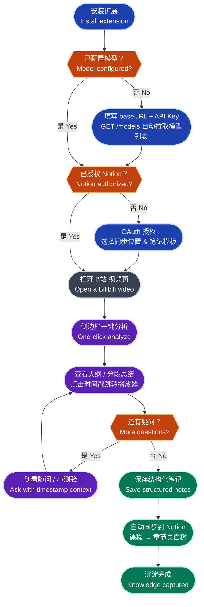
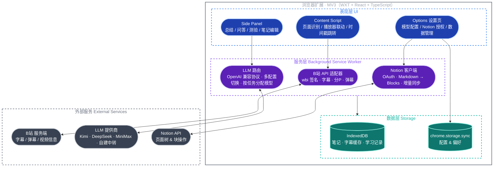

# AiStudy

**AI 视频学习助手 —— 把 B站变成你的专属 AI 课堂**
**AI Video Study Assistant — Turn Bilibili into your personal AI classroom**

[](LICENSE)


[简体中文](#简体中文) · [English](#english)

---

## 简体中文

AiStudy 是一个**开源的浏览器扩展（Chrome / Edge，Manifest V3）**：在 B站看视频时，它自动提取字幕与章节，用你自己配置的 AI 模型生成课程大纲、分段总结和难点讲解，把要点整理成结构化笔记，并一键同步到 Notion —— 让每一次「看视频学习」都真正沉淀为知识。

### 为什么做 AiStudy

- 在 B站学一门课，看完就忘，随手记的笔记散落在微信、备忘录和弹幕里
- 2 小时的课程视频，真正有价值的也许只有 20 分钟，但没有大纲你找不到它们
- 通用 AI 助手不知道你「正在看哪个视频、看到第几分几秒」，每次都要复制粘贴上下文
- 现有工具要么锁定单一模型、要么把数据上传到别人的服务器

AiStudy 的答案：**本地优先、自带密钥（BYOK）、模型自由、笔记进 Notion**。

### 功能特性

| 功能 | 说明 | 状态 |
|---|---|---|
| 视频总结 & 课程大纲 | 自动提取字幕与分 P 章节，生成课程大纲、分段总结、难点讲解 | 开发中（MVP） |
| 关键时间戳跳转 | 笔记与总结中的时间点，一键跳转到播放器对应位置 | 开发中（MVP） |
| Notion 双向同步 | OAuth 授权后按「课程 → 章节」自动建页面树；区分学习/工作笔记模板 | 开发中（MVP） |
| 多模型配置 | 统一 OpenAI 兼容协议：填 baseURL + API Key，自动拉取模型列表，Kimi / DeepSeek / MiniMax / 任意中转站均可接入 | 开发中（MVP） |
| 本地笔记库 | IndexedDB 本地存储全部笔记、字幕缓存与学习记录 | 开发中（MVP） |
| 随看随问 | 侧边栏对话，自动携带当前视频时间戳上下文 | 规划中（V2） |
| 知识点小测验 | 基于视频内容生成测验题，定位薄弱环节并针对性讲解 | 规划中（V2） |
| 任务级模型路由 | 总结用便宜模型、讲解用强模型，省钱又好用 | 规划中（V2） |
| AI 扩写与润色 | 把提纲一键扩写成完整笔记，支持润色与翻译 | 规划中（V2） |
| 网页剪藏 & 稍后读 | 公众号文章、网页内容剪藏与总结 | 规划中（V2） |
| 间隔重复复习 | 基于记忆曲线的复习提醒，支持 Anki 卡片导出 | 规划中（V3） |
| 知识图谱 & 语义搜索 | 笔记向量化，全库语义搜索，知识点互联成图 | 规划中（V3） |
| 学习周报 | 自动汇总本周看过的视频与笔记，生成学习报告 | 规划中（V3） |
| 多站点支持 | 中国大学 MOOC、YouTube、知乎等站点适配器 | 规划中（V3） |

### 完整使用流程

1. **安装扩展** → 打开设置页，填入模型服务的 baseURL 和 API Key，自动拉取模型列表并选择默认模型
2. **连接 Notion** → OAuth 授权，选择同步的父页面与笔记模板（学习笔记 / 工作笔记）
3. **打开 B站视频页** → 扩展自动识别，侧边栏显示「一键分析」
4. **AI 分析** → 提取字幕/弹幕/章节，生成课程大纲、分段总结与难点讲解，全程流式输出
5. **边看边学** → 点击时间戳跳转播放器；有疑问随时在侧边栏追问（V2）
6. **沉淀笔记** → AI 生成 + 手动批注，合并为结构化笔记存入本地
7. **同步归档** → 按「课程 → 章节」层级自动同步到 Notion，随时双向更新
8. **复习巩固** → 间隔重复提醒、Anki 导出、知识图谱回顾（V3）

### 核心逻辑流程图


### 功能流程图



### 系统架构图


### 技术栈

| 层 | 选型 |
|---|---|
| 扩展框架 | WXT（Manifest V3，热更新，Chrome / Edge / Firefox 一套代码） |
| 前端 | React 18 + TypeScript + Tailwind CSS |
| 字幕获取 | B站 `x/player/wbi/v2` 字幕接口（wbi 签名）+ 分 P / 弹幕接口 |
| 模型层 | OpenAI Chat Completions 兼容适配器，流式 SSE 输出 |
| 本地存储 | IndexedDB（Dexie）+ chrome.storage |
| Notion | 官方 API + OAuth，Markdown 转 Notion Blocks |
| 包管理 / 构建 | pnpm + Vite（WXT 内置） |

### 快速开始

前置要求：Node.js ≥ 20，pnpm ≥ 9，Chrome 或 Edge。

```bash
git clone https://github.com/<your-username>/AiStudy.git
cd AiStudy
pnpm install

pnpm dev        # 开发模式：自动启动浏览器并热更新
pnpm build      # 生产构建，产物在 .output/chrome-mv3
pnpm zip        # 打包为可分发的 zip
```

手动加载：`chrome://extensions` → 打开「开发者模式」→「加载已解压的扩展程序」→ 选择 `.output/chrome-mv3`。

### 配置指南

**模型配置（BYOK，自带密钥）**

1. 打开扩展「设置 → 模型服务 → 新增配置」
2. 填写名称、`baseURL`（如 `https://api.moonshot.cn/v1`）、API Key
3. 点击「拉取模型列表」—— 自动调用 `GET {baseURL}/models`，选择默认模型
4. 支持任意 OpenAI 兼容端点：Kimi、DeepSeek、MiniMax、自建中转站等
5. 可保存多套配置随时切换；V2 起支持按任务分配模型（总结 / 讲解 / 问答各用各的）

**Notion 同步**

1. 「设置 → 集成 → 连接 Notion」，跳转 OAuth 授权
2. 选择一个父页面作为同步根目录
3. 选择默认笔记模板（学习笔记 / 工作笔记）
4. 之后每分析一个视频，自动按「课程 → 章节」层级创建页面并保持增量更新

### 数据与隐私

- **本地优先**：笔记、字幕缓存、学习记录全部存于本机 IndexedDB
- **密钥不出机**：API Key 仅保存在 `chrome.storage.local`，永不上传任何服务器
- **内容直达你的模型**：字幕内容只发送给你自己配置的模型端点，不经过任何第三方中转
- **零遥测**：不内置任何埋点、统计或追踪

### 路线图

| 版本 | 目标 | 内容 |
|---|---|---|
| MVP（v0.1） | 打通核心闭环 | 字幕提取 → AI 总结/大纲 → 时间戳跳转 → 本地笔记 → Notion 同步 → 多模型配置 |
| V2（v0.2） | 学习辅导与效率 | 随看随问、小测验、任务级模型路由、AI 扩写/润色、网页剪藏、学习统计 |
| V3（v0.3） | 长期知识沉淀 | 间隔重复、Anki 导出、语义搜索、知识图谱、学习周报、多站点适配 |

### 项目结构（规划）

```text
AiStudy/
├── entrypoints/
│   ├── background.ts        # Service Worker：消息路由、API 编排
│   ├── content.ts           # Content Script：B站页面注入与播放器联动
│   ├── sidepanel/           # Side Panel：总结 / 问答 / 测验 / 笔记
│   └── options/             # 设置页：模型配置 / Notion 授权 / 数据管理
├── lib/
│   ├── bilibili/            # wbi 签名、字幕 / 分P / 弹幕 API
│   ├── llm/                 # OpenAI 兼容适配器、模型路由
│   ├── notion/              # OAuth、Markdown → Blocks、增量同步
│   └── storage/             # IndexedDB / chrome.storage 封装
├── components/              # 共享 React 组件
├── assets/                  # 样式与静态资源
└── wxt.config.ts
```

### 我们的期望

- **对学习者的期望**：看完任何一节视频，3 分钟内拿到大纲、重点和一份可以检索的笔记；「看过了」变成「学会了」
- **对产品的期望**：成为 B站学习场景里体验最好的开源 AI 助手，然后走向更多知识平台
- **对社区的期望**：一起共建站点适配器、笔记模板和 Prompt 库 —— 数据属于用户，模型自由选择，代码完全开放

### 参与贡献

欢迎 Issue 和 PR：新站点适配器、笔记模板、Prompt 优化、Bug 修复都是宝贵的贡献。提交 PR 前请先确认对应 Issue 存在并已被认领，大改动请先在 Issue 中讨论方案。

### License

[MIT](LICENSE)

---

## English

AiStudy is an **open-source browser extension (Chrome / Edge, Manifest V3)**: while you watch videos on Bilibili, it automatically extracts subtitles and chapters, uses your own AI model to generate course outlines, section summaries and explanations, turns them into structured notes, and syncs everything to Notion — so every video you watch becomes knowledge you keep.

### Why AiStudy

- You finish a course on Bilibili and forget it a week later; your notes are scattered across chat apps and memos
- In a 2-hour lecture video, maybe 20 minutes really matter to you — but without an outline you can't find them
- Generic AI assistants don't know *which video you're watching at which timestamp*; you copy-paste context every time
- Existing tools either lock you into one model or upload your data to someone else's server

AiStudy's answer: **local-first, bring your own key (BYOK), model freedom, notes in Notion**.

### Features

| Feature | Description | Status |
|---|---|---|
| Video summary & course outline | Extracts subtitles and multi-part chapters; generates outlines, section summaries and explanations of hard points | In progress (MVP) |
| Timestamp deep-links | Jump from any note/summary timestamp straight to that position in the player | In progress (MVP) |
| Notion two-way sync | After OAuth, builds a "Course → Chapter" page tree automatically; separate templates for study & work notes | In progress (MVP) |
| Multi-model configuration | Unified OpenAI-compatible protocol: enter baseURL + API Key, auto-fetch the model list; works with Kimi, DeepSeek, MiniMax or any relay | In progress (MVP) |
| Local note library | All notes, subtitle caches and learning records stored in IndexedDB | In progress (MVP) |
| Ask while watching | Side-panel chat that automatically carries the current video timestamp as context | Planned (V2) |
| Knowledge quizzes | Generates quizzes from video content to find and fix weak spots | Planned (V2) |
| Per-task model routing | Cheap models for summaries, strong models for explanations | Planned (V2) |
| AI expansion & polish | Expand outlines into full notes; polish and translate | Planned (V2) |
| Web clipping & read-later | Clip and summarize articles and web pages | Planned (V2) |
| Spaced repetition | Review reminders based on memory curves, with Anki card export | Planned (V3) |
| Knowledge graph & semantic search | Vectorized notes, full-library semantic search, connected knowledge graph | Planned (V3) |
| Weekly learning report | Auto-generated report of the week's videos and notes | Planned (V3) |
| Multi-site support | Adapters for China MOOC, YouTube, Zhihu and more | Planned (V3) |

### The Complete Flow

1. **Install the extension** → open Settings, enter your model provider's baseURL and API Key, auto-fetch the model list and pick a default model
2. **Connect Notion** → authorize via OAuth, choose the parent page and a note template (study / work)
3. **Open a Bilibili video** → the extension detects the page and shows "Analyze" in the side panel
4. **AI analysis** → subtitles/danmaku/chapters are extracted; outline, section summaries and explanations stream in
5. **Learn while watching** → click a timestamp to seek the player; ask follow-up questions any time (V2)
6. **Capture notes** → AI-generated content plus your annotations merge into structured local notes
7. **Sync & archive** → notes sync to Notion under a "Course → Chapter" hierarchy with incremental updates
8. **Review & retain** → spaced-repetition reminders, Anki export, knowledge graph (V3)

### Core Logic Flow

```mermaid
flowchart LR
    classDef user fill:#374151,stroke:#d1d5db,stroke-width:2px,color:#fff
    classDef capture fill:#1e40af,stroke:#bfdbfe,stroke-width:2px,color:#fff
    classDef ai fill:#5b21b6,stroke:#ddd6fe,stroke-width:2px,color:#fff
    classDef note fill:#047857,stroke:#a7f3d0,stroke-width:2px,color:#fff
    classDef review fill:#c2410c,stroke:#fed7aa,stroke-width:2px,color:#fff

    User((学习者<br/>Learner)):::user

    subgraph Capture["① 采集 Capture"]
        direction TB
        Detect(["识别 B站 播放页<br/>Detect video page"]):::capture
        Extract(["字幕 / 弹幕 / 分P 章节<br/>Subtitles & chapters"]):::capture
        Detect --> Extract
    end

    subgraph AI["② AI 分析 Analysis"]
        direction TB
        Summary(["课程大纲 & 分段总结<br/>Outline & summary"]):::ai
        Chat(["随看随问 / 难点讲解<br/>Q&A & explanations"]):::ai
        Quiz(["知识点小测验<br/>Quizzes"]):::ai
    end

    subgraph Notes["③ 沉淀 Knowledge"]
        direction TB
        Structured(["结构化笔记<br/>Structured notes"]):::note
        Local[("本地库<br/>IndexedDB")]:::note
        NotionSync(["Notion 双向同步<br/>课程 → 章节目录树"]):::note
        Structured --> Local
        Local --> NotionSync
    end

    subgraph Review["④ 复习 Review · V3"]
        direction TB
        SRS(["间隔重复提醒<br/>Spaced repetition"]):::review
        Graph(["知识图谱 & 语义搜索<br/>Graph & search"]):::review
        SRS --> Graph
    end

    User --> Detect
    Extract -->|"字幕 Transcript"| Summary
    Extract -->|"字幕 + 时间戳"| Chat
    Extract -->|"知识点 Points"| Quiz
    Summary -->|"大纲"| Structured
    Chat -->|"问答记录"| Structured
    Quiz -->|"测验结果"| Structured
    NotionSync -.->|"复习数据"| SRS

    style Capture fill:none,stroke:#3b82f6,stroke-width:2px,stroke-dasharray:5 5,color:#3b82f6
    style AI fill:none,stroke:#8b5cf6,stroke-width:2px,stroke-dasharray:5 5,color:#8b5cf6
    style Notes fill:none,stroke:#10b981,stroke-width:2px,stroke-dasharray:5 5,color:#10b981
    style Review fill:none,stroke:#f97316,stroke-width:2px,stroke-dasharray:5 5,color:#f97316
```



### Feature Flow


### System Architecture



### Tech Stack

| Layer | Choice |
|---|---|
| Extension framework | WXT (Manifest V3, HMR, one codebase for Chrome / Edge / Firefox) |
| Frontend | React 18 + TypeScript + Tailwind CSS |
| Subtitle extraction | Bilibili `x/player/wbi/v2` subtitle API (wbi signing) + multi-part / danmaku APIs |
| Model layer | OpenAI Chat Completions compatible adapter, streaming SSE |
| Local storage | IndexedDB (Dexie) + chrome.storage |
| Notion | Official API + OAuth, Markdown → Notion Blocks |
| Package / build | pnpm + Vite (built into WXT) |

### Quick Start

Prerequisites: Node.js ≥ 20, pnpm ≥ 9, Chrome or Edge.

```bash
git clone https://github.com/<your-username>/AiStudy.git
cd AiStudy
pnpm install

pnpm dev        # Dev mode: launches a browser with hot reload
pnpm build      # Production build, output in .output/chrome-mv3
pnpm zip        # Package as a distributable zip
```

Manual load: `chrome://extensions` → enable "Developer mode" → "Load unpacked" → select `.output/chrome-mv3`.

### Configuration

**Model setup (BYOK)**

1. Open extension "Settings → Model Providers → Add"
2. Enter a name, the `baseURL` (e.g. `https://api.moonshot.cn/v1`) and your API Key
3. Click "Fetch models" — it calls `GET {baseURL}/models` automatically; pick a default model
4. Any OpenAI-compatible endpoint works: Kimi, DeepSeek, MiniMax, self-hosted relays, etc.
5. Save multiple profiles and switch any time; from V2 you can assign models per task (summary / explanation / chat)

**Notion sync**

1. "Settings → Integrations → Connect Notion" and authorize via OAuth
2. Pick a parent page as the sync root
3. Choose a default template (study notes / work notes)
4. Every analyzed video then creates and incrementally updates a "Course → Chapter" page tree

### Data & Privacy

- **Local-first**: notes, subtitle caches and learning records live in your browser's IndexedDB
- **Keys never leave your machine**: API Keys are stored only in `chrome.storage.local`, never uploaded anywhere
- **Content goes straight to your model**: subtitles are sent only to the endpoint you configured — no third-party relay
- **Zero telemetry**: no analytics, no tracking, no phoning home

### Roadmap

| Version | Goal | Scope |
|---|---|---|
| MVP (v0.1) | Close the core loop | Subtitle extraction → AI summary/outline → timestamp links → local notes → Notion sync → multi-model config |
| V2 (v0.2) | Tutoring & efficiency | Ask-while-watching, quizzes, per-task model routing, AI expansion/polish, web clipping, study stats |
| V3 (v0.3) | Long-term knowledge | Spaced repetition, Anki export, semantic search, knowledge graph, weekly reports, multi-site adapters |

### Project Structure (planned)

```text
AiStudy/
├── entrypoints/
│   ├── background.ts        # Service Worker: message routing, API orchestration
│   ├── content.ts           # Content Script: Bilibili page injection, player control
│   ├── sidepanel/           # Side Panel: summary / chat / quiz / notes
│   └── options/             # Options page: model config / Notion auth / data
├── lib/
│   ├── bilibili/            # wbi signing, subtitle / multi-part / danmaku APIs
│   ├── llm/                 # OpenAI-compatible adapter, model routing
│   ├── notion/              # OAuth, Markdown → Blocks, incremental sync
│   └── storage/             # IndexedDB / chrome.storage wrappers
├── components/              # Shared React components
├── assets/                  # Styles and static assets
└── wxt.config.ts
```

### What We Hope For

- **For learners**: within 3 minutes of finishing any video, have an outline, the key points and a searchable note — "watched" becomes "learned"
- **For the product**: become the best open-source AI study assistant for Bilibili, then grow to more knowledge platforms
- **For the community**: build site adapters, note templates and prompt libraries together — users own their data, choose their models, and audit every line of code

### Contributing

Issues and PRs are welcome: new site adapters, note templates, prompt improvements and bug fixes are all valuable. Please make sure an issue exists and is claimed before opening a PR, and discuss large changes in an issue first.

### License

[MIT](LICENSE)
