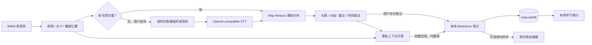
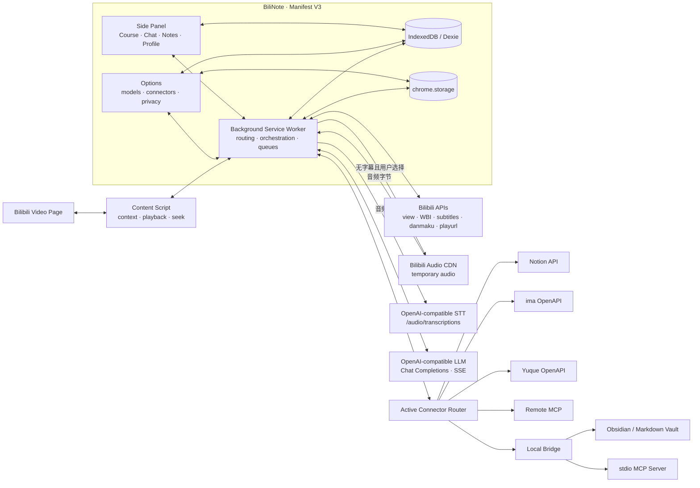
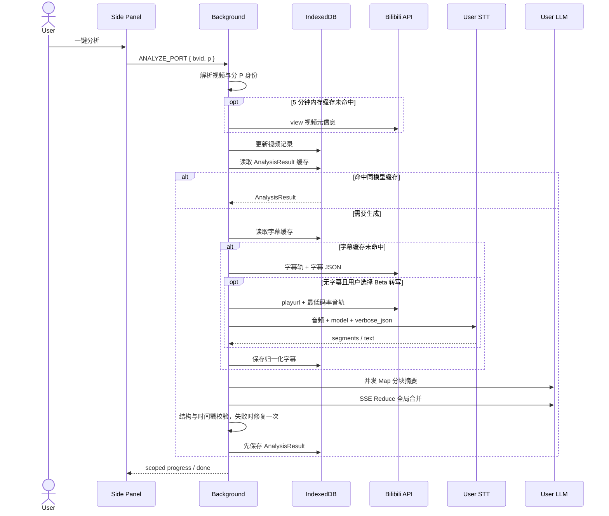
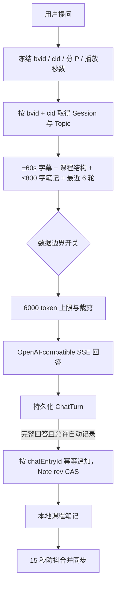

<div align="center">


# BiliNote

**把 Bilibili 视频变成带时间锚点的课程、对话与知识笔记**

一个 Local-first、BYOK 的开源浏览器扩展。优先读取视频已有字幕；无字幕时可由用户选择语音转写，再用自己的模型完成课程分析与随看随问，把 Markdown 笔记保存在本地或同步到自己的知识库。

[](LICENSE)
[](https://wxt.dev/)
[](https://www.typescriptlang.org/)
[](https://developer.chrome.com/docs/extensions/develop/migrate/what-is-mv3)
[](https://github.com/AliceDel66/BiliNote/releases)
[](https://github.com/AliceDel66/BiliNote/stargazers)

**简体中文** · [English](README.en.md)

[项目赞助商：Token小铺](https://api.zgonline.top/) · [免费语音转写 API：Groq](https://groq.com/)

[工作原理](#工作原理) · [系统架构](#系统架构) · [核心流程](#核心流程) · [赞助支持](#赞助支持) · [数据与隐私](#数据与隐私) · [快速开始](#快速开始) · [参与贡献](#参与贡献)

</div>

> [!IMPORTANT]
> BiliNote 默认读取 Bilibili 已提供的字幕，不会自动下载或上传媒体。只有无字幕且用户点击“使用语音转写（Beta）”时，扩展才会临时拉取当前分 P 的最低码率 DASH 音轨；无 DASH 时可能回退到 MP4 混流，并把该文件发送到用户配置的 OpenAI-compatible STT 服务。Phase 1 仅支持单文件不超过 25MB，暂不支持分段转写。

> [!NOTE]
> 本文档对应 `v0.1.1` 与当前 `main`。`v0.1.1` 首次打包无字幕视频的 Beta 语音转写，并新增语雀官方 OpenAPI 连接器；当前仍是 pre-alpha，建议开发者和早期用户试用。

## BiliNote 是什么

BiliNote 把视频学习拆成四个连续界面，并让同一份本地课程数据贯穿其中：

| 界面 | 作用 |
| --- | --- |
| **课程** | 识别当前视频与分 P，读取已有字幕或按需语音转写，生成课程大纲、分段总结、重点、拓展知识与注意事项 |
| **对话** | 冻结当前播放位置，用附近字幕、课程结构和笔记摘录回答问题；完整回答可写入课程笔记 |
| **笔记** | 编辑和预览 Markdown，保留时间戳，并把本地笔记同步到所选知识库；底层会保留最近版本 |
| **我的** | 直接从本地分析、笔记和问答记录计算学习统计、连续天数、活动热力图与课程进度 |

项目没有托管业务后端。视频上下文、笔记、分析缓存和问答记录保存在浏览器；模型调用、语音转写和知识库同步从扩展直接发往用户配置的服务。

## 赞助支持

- **项目赞助商**：[Token小铺 AI API Gateway](https://api.zgonline.top/)
- **免费语音转写 API**：[Groq](https://groq.com/) 的 GroqCloud 提供可免费开始的 Free tier，并兼容 BiliNote 当前使用的 `/audio/transcriptions` 协议；额度、限速、价格和模型可用性以 Groq 当前政策为准。

BiliNote 不内置共享 API Key，也不会默认把请求发往赞助商或 Groq。模型与语音转写服务都由用户主动配置、授权和承担相应服务条款。

## 工作原理



核心原则：

- **Local-first**：本地笔记是 source of truth，外部知识库是可重建的派生产物；
- **BYOK**：模型与 STT API Key、知识库令牌和写入目标由用户配置；
- **Context-aware**：分析、问答、笔记都绑定 `bvid + cid`，时间锚点能跳回对应画面；
- **Adapter-based**：Notion、ima、MCP 与本地 Markdown 都实现同一写入接口，不进入核心笔记模型；
- **Auditable**：权限、存储、网络目的地和失败路径都能从源码追踪。

## 系统架构



### 运行边界

| 边界 | 责任 | 不负责 |
| --- | --- | --- |
| [`entrypoints/content.ts`](entrypoints/content.ts) | 识别 Bilibili SPA 路由、返回当前播放时间、执行同 P 或跨 P 跳转 | 跨域请求、模型调用、数据持久化 |
| [`entrypoints/sidepanel/`](entrypoints/sidepanel/) | 四个用户工作区、流式进度、Markdown 编辑与学习统计 | 持有长任务、直接调用第三方 API |
| [`entrypoints/options/`](entrypoints/options/) | 模型 Profile、连接器、数据边界、导出与清空 | 保存业务笔记、编排分析 |
| [`entrypoints/background.ts`](entrypoints/background.ts) | 消息路由、跨域请求、分析与 Chat Port、按需音轨下载和 STT、串行同步队列、Service Worker 恢复 | 展示状态、持有唯一业务数据副本 |
| [`lib/`](lib/) | Bilibili、LLM、Transcribe、Summarization、Chat、Storage、Connector、Notion 与 Stats 领域模块 | UI 布局与浏览器页面操作 |
| [`scripts/bridge.mjs`](scripts/bridge.mjs) | 仅监听 loopback 的 Markdown Bridge；把 stdio MCP 转为扩展可调用的 HTTP | 云端托管、凭据托管、远程访问 |

Background Service Worker 是网络和长任务的编排中心。Content Script 只接触页面；Side Panel 与 Options 负责交互；Dexie 和 `chrome.storage` 承担持久化。这一划分同时匹配 MV3 生命周期、Host Permission 和可测试性边界。

## 核心流程

### 1. 视频识别、字幕与语音转写

1. Content Script 从当前 URL 提取 `bvid` 与分 P，监听 Bilibili SPA 路由变化，并暴露播放时间与 seek 消息。
2. Background 查询活动标签页。若扩展重载前页面已打开，它会先补注入 Content Script；仍失败时退化为 URL 解析。
3. Bilibili Adapter 调用 view API 获取 `aid`、`cid`、标题、封面、UP 主和分 P 信息，并在 Dexie 更新视频记录。
4. 字幕请求使用 WBI 签名。轨道选择顺序为：中文人工字幕、其他人工字幕、中文字幕、首个可用轨道。
5. 字幕 CDN JSON 被归一化为 `Cue[]`，按 `bvid + cid` 存储并在 24 小时内复用。可选弹幕只作为辅助上下文；获取失败不会阻断字幕分析。
6. 没有字幕时，Background 先返回 `no-subtitle`。用户可保持降级状态、重试字幕，或主动选择“使用语音转写（Beta）”。转写路径读取 playurl、优先选择最低码率 DASH 音轨；无 DASH 时回退首个 `video/mp4` 混流，临时载入内存并上传到配置的 STT 服务，再把 `verbose_json` segments 归一化为 `Cue[]`。

转写结果以 `source: stt` 写入字幕缓存，24 小时内可直接复用并进入正常分析；过期记录不会因此立即物理删除。音频或 MP4 字节不写入 IndexedDB。下载前后都会执行 25MB 上限检查，Phase 1 超限即停止，不会静默截断或伪造字幕。

### 2. 课程分析



分析管线的关键约束：

- 缓存身份包含 `bvid + cid + Profile 名称 / 模型 / baseURL`，切换同名模型服务不会误用旧结果；
- 字幕超过预算时使用 60% 上下文预算切块，块间保留约 30 秒重叠；Map 并发上限为 3；
- Reduce 通过 SSE 流式返回，UI 可展示阶段和增量内容，也可取消；
- 输出先解析为结构化 JSON，校验章节和时间戳；失败时只修复一次，再失败则保留原始 Markdown；
- Background 先持久化结果，再发送 `done`；缓存写入失败不会被伪装成成功；
- 分析结果会携带字幕来源；使用 STT 时 UI 明示“字幕为 AI 转写”；
- 每个事件携带 `bvid + cid + p`，切换视频后的迟到事件会被 UI 丢弃。

### 3. 随看随问



- 每个话题固定一个播放锚点；用户可以显式把后续问题更新到当前进度。
- Context 完整度分为 `full`、`partial`、`none`。关闭课程内容发送或没有字幕时，Prompt 必须声明无法核对讲师原意。
- 字幕和笔记以不可信数据边界包裹，伪造的边界标签会被中和。总结解析会剥离 `<think>` block；Chat 只兜底清理可识别的长前置思考稿，不保证过滤所有推理文本。
- `clientRequestId` 防止重连重复生成，`ChatTurn.id` 同时作为 `chatEntryId`，支持定点撤销、不记录和重新记录。
- 当前 provider-native Web Search 只对已知兼容端点启用；代码内置 Moonshot/Kimi `$web_search` 协议循环。未知 Provider 不会盲目发送 tools。
- 取消会保留已产生的回答片段，但不会写入笔记；回答生成和笔记写入失败分别记录，互不覆盖。

### 4. 笔记与同步

本地 Markdown 笔记是系统唯一 source of truth：

1. 课程分析可生成一份带视频元信息、原链接和时间锚点的笔记；对话也能按当前 `cid` 自动创建或找到目标笔记。
2. 编辑器防抖保存。每次写入递增 `rev`，内容变化时在底层保留最近 10 个版本；当前 UI 尚未提供版本浏览或恢复入口。
3. Chat 通过 Compare-And-Swap（CAS）追加问答块；与手工编辑冲突时读取最新版本并重放，最多重试 3 次，不静默覆盖。
4. 保存后按当前激活连接器进入全局串行队列。Service Worker 重启会把遗留 `syncing` 恢复为 `pending` 并重新入队。
5. 同步成功只清除本地 `dirty` 标记；连接器映射保存外部文档 ID 和状态，不替代本地笔记。

## 知识库连接器

连接器统一实现 `testConnection()` 与 `upsertCourseNote()`。同一时刻只有一个默认写入目标。当前同步方向是 **BiliNote → 外部知识库**，不会把外部内容拉入 Chat，也不承诺双向同步。

| 预设 | 传输与写入语义 | 边界 |
| --- | --- | --- |
| **Notion** | Internal Integration Token；用户先选择根页面，连接器在其下建立“课程页 → 分 P 章节页”；归档旧 blocks 后整页重写 | 检测本地与远端双改冲突；不是 OAuth |
| **ima（Beta）** | 官方 OpenAPI；首次导入 Markdown 并加入选定知识库，后续只追加新增尾部 | API 无整篇覆盖时，已同步前缀被改写会停止同步，避免重复或丢改动 |
| **腾讯文档（Beta）** | 官方 Remote MCP；原始 `Authorization` Token | 工具能力与参数由端点返回结果映射 |
| **飞书文档（Beta）** | 个人 Remote MCP URL，URL 本身作为凭据 | 工具能力与参数由端点返回结果映射 |
| **Custom Remote MCP** | 公网 HTTPS MCP；`initialize → tools/list → tools/call` | 保存时静态拦截 loopback、常见私网字面地址和明文 HTTP；按精确 origin 申请权限 |
| **Obsidian** | 本机 Markdown Bridge 写入 Vault 内 `BiliNote/` 目录 | Bridge 只监听 `127.0.0.1`，要求 Bearer Token 和 root 路径 containment |
| **语雀（Beta）** | 官方 OpenAPI；Token 鉴权后选择目标知识库，首次新建 Markdown 文档，后续整篇更新 | 当前仅支持 `yuque.com` 官方云域名；目录写入失败时文档仍会保留，可在语雀内手动编排 |

MCP 写入会从工具名和常见参数名推断 `create`、`append` 或 `update` 能力，因此 Remote MCP 预设属于适配层，不等于任意 MCP Server 都能无配置工作。

## 数据模型

### IndexedDB：业务数据

Dexie 数据库名为 `bilinote`：

| 表 | 主键 / 身份 | 内容 |
| --- | --- | --- |
| `videos` | `bvid` | 视频元信息、分 P、首次与最近访问时间 |
| `subtitles` | `bvid + cid` | 归一化字幕 Cue、语言、人工 / Bilibili AI / STT 来源、缓存时间 |
| `summaries` | `bvid + cid + modelId` | 结构化课程分析与输入 token 粗估 |
| `notes` | 自增 ID | Markdown、模板、来源、`dirty`、`rev` 与时间戳 |
| `noteVersions` | 自增 ID | 每份笔记最近 10 个内容版本 |
| `chatSessions` | `bvid + cid` | 课程会话与目标笔记 |
| `chatTopics` | Topic ID | 话题标题和固定播放锚点 |
| `chatTurns` | Turn ID / `clientRequestId` | 问题、回答、生成状态和写笔记状态 |
| `notionMappings` | Note ID | Notion 页面树、scope、冲突基线和同步状态 |
| `connectorSync` | Note ID + Connector ID | 非 Notion 外部文档 ID 和同步状态 |

### chrome.storage：配置

| 存储域 | 内容 | 是否进入浏览器同步 |
| --- | --- | --- |
| `chrome.storage.local` | 模型 Profile 与 API Key、语音转写 baseURL / API Key / model、Notion Token、Connector Profile 与凭据 | 否 |
| `chrome.storage.sync` | 主题、激活模型、上下文预算、分析与 Chat 偏好、数据边界开关 | 浏览器开启同步时可能同步 |

数据导出包含业务表和偏好，不包含模型 API Key、语音转写 API Key、Notion Token、MCP Token、ima 凭据等连接配置。清空本地数据会删除 Dexie、`storage.local` 和 `storage.sync`，界面要求二次确认。

## 数据与隐私

BiliNote 的 Local-first 指“业务数据默认以本地浏览器为主”，不代表 AI 推理在本地运行。触发分析、问答或同步时，以下数据会发送到明确的外部目的地：

| 目的地 | 发送内容 | 触发条件 |
| --- | --- | --- |
| Bilibili API / 字幕与媒体 CDN | 视频 ID、分 P、字幕请求；请求可能携带当前 Bilibili 登录态。仅在用户选择语音转写时请求 playurl，并临时下载当前分 P 的 DASH 音轨或 MP4 混流 | 打开视频、分析、Chat 缺少字幕缓存，或用户主动转写 |
| 用户配置的模型端点 | 分析字幕；或 Chat 的最小上下文与问题 | 用户主动分析或提问 |
| 用户配置的语音转写端点 | 当前分 P 的 DASH 音频或 MP4 混流、所选 model；“测试”操作会发送 1 秒本地生成的静音 WAV | 用户点击“使用语音转写”或测试 STT 连接 |
| 当前激活知识库连接器 | 目标笔记 Markdown 与课程 / 分 P 标题 | 手动同步或已启用的自动同步 |
| 无 | 本地学习统计 | 直接从 Dexie 计算，不发送遥测 |

Chat 提供三个逐源开关：课程内容、当前笔记摘录、播放元信息。代码默认开启，但只组装当前问题需要的字幕窗口和受限摘录；任一来源都能在 Options 中关闭。

配置默认写入连接器后，自动同步偏好默认为开启；未配置连接器时不会发出远端写入。

安全边界：

- 模型、STT API Key 与知识库凭据只写入 `chrome.storage.local`，不会进入数据导出或 `storage.sync`；
- `chrome.storage.local` 是浏览器 Profile 内的本地存储，不是加密保险箱或硬件密钥库；
- 保存模型或 STT 配置时会拒绝非 loopback `http://`；测试动作本身也会发送 Key 与请求，因此不要测试不可信的明文端点。Remote MCP 会静态拦截常见本机与私网字面地址，但这不构成 DNS 或网络级沙箱，只应连接可信端点；
- 模型、STT、远端连接器与 Local Bridge 按实际 origin 请求 Optional Host Permission；Bilibili、字幕与音频 CDN 是固定权限；
- 音频只在一次转写任务的内存中暂存，不写入 Dexie；`declarativeNetRequest` 规则只为 `bilivideo.com` 音轨请求补充 Bilibili `Referer`；
- AI Markdown 经 DOMPurify 清洗后再渲染；
- 字幕和用户笔记在 Prompt 中被标记为不可信数据，并中和伪造的边界标签，以降低 prompt injection 风险；
- 项目源码未包含遥测、广告 SDK 或托管账号系统。

### 浏览器权限

| 权限 | 用途 |
| --- | --- |
| `storage` | 保存本地配置和偏好 |
| `sidePanel` | 在视频旁提供持续学习界面 |
| `scripting` | 扩展安装或重载后，为已经打开的视频页补注入 Content Script |
| `declarativeNetRequest` | 仅为 `bilivideo.com` 音轨下载补充 Bilibili `Referer`，避免 CDN 防盗链返回 403 |
| `*://*.bilibili.com/*` | 视频信息、WBI、字幕轨与页面上下文 |
| `*://*.hdslb.com/*` | 下载 Bilibili 返回的字幕 CDN JSON |
| `*://*.bilivideo.com/*` | 仅在用户选择语音转写时临时下载当前分 P 音轨 |
| 可选 `*://*/*` | 只在用户测试、保存或连接模型、STT 与远端连接器时，按具体 origin 请求授权 |

## 快速开始

### 安装 v0.1.1 发布包

1. 从 [BiliNote v0.1.1 GitHub Release](https://github.com/AliceDel66/BiliNote/releases/tag/v0.1.1) 下载 `bilinote-0.1.1-chrome.zip` 并解压；
2. 打开 `chrome://extensions`，启用“开发者模式”；
3. 点击“加载已解压的扩展程序”，选择解压目录；
4. 打开 BiliNote Options，配置自己的模型 API，以及可选的语音转写与知识库连接。

当前是未上架 Chrome Web Store 的 pre-alpha 开发者包。升级时先解压新版本，再在扩展管理页重新加载对应目录；配置与本地数据仍由浏览器扩展存储管理。

### 前置条件

- Node.js `^20.19.0` 或 `>=22.12.0`（当前 lockfile 中构建工具链的要求）；
- pnpm；
- Chrome；当前仓库只构建并验证 Chrome MV3，其他 Chromium 浏览器未形成兼容性承诺；
- 一个 OpenAI Chat Completions compatible 模型服务，以及自己的 API Key；
- 一个 Bilibili 视频；无可用字幕时，需要另行配置 OpenAI-compatible 语音转写服务。

### 从源码运行

```bash
git clone https://github.com/AliceDel66/BiliNote.git
cd BiliNote
pnpm install
pnpm compile
pnpm test
pnpm dev
```

然后：

1. 打开 `chrome://extensions`；
2. 启用“开发者模式”；
3. 点击“加载已解压的扩展程序”，选择 `.output/chrome-mv3-dev`；
4. 打开 BiliNote Options，新增 `name + baseURL + API Key + default model`；
5. 拉取模型列表或测试连接，并授权该模型服务的 origin；
6. 打开 Bilibili 视频，点击扩展图标打开 Side Panel；无字幕时可继续配置并使用 Beta 语音转写。

生产构建使用：

```bash
pnpm build
```

构建产物位于 `.output/chrome-mv3`，可按相同步骤加载。`pnpm zip` 用于生成可分发压缩包。

### 为无字幕视频配置 Groq 语音转写

[Groq](https://groq.com/) 的 GroqCloud 提供可免费开始的 Free tier 和 OpenAI-compatible Speech-to-Text。当前 BiliNote 配置示例，无需修改 `.env`：

| 字段 | 示例 |
| --- | --- |
| `baseURL` | `https://api.groq.com/openai/v1` |
| `API Key` | 从 Groq Console 创建的 `gsk_...` |
| `model` | `whisper-large-v3-turbo`（速度优先）或 `whisper-large-v3`（准确率优先） |

1. 打开 Options → “语音转写（Beta）”，填入三项配置；
2. 点击“测试”。扩展会先申请 Groq origin 权限，再发送 1 秒本地生成的静音 WAV；该请求也会消耗服务额度；
3. 测试成功后保存；
4. 打开无字幕视频并发起分析，出现 `no-subtitle` 后点击“使用语音转写（Beta）”。

当前实现按单文件 25MB 上限工作，不做切片。超长视频可能因最低码率音轨仍超限而无法转写；无 DASH 时还可能上传 MP4 混流。转写成功后只保存归一化文字与时间段，24 小时内复用，不保存媒体字节。Groq 免费额度、速率限制、价格和模型可用性可能变化，以其官网与 [Speech-to-Text 文档](https://console.groq.com/docs/speech-to-text)为准。

#### 转写服务怎么选（按推荐排序）

| 推荐 | baseURL / model | 适合谁 | 注意 |
| --- | --- | --- | --- |
| **首选 · Groq** | `https://api.groq.com/openai/v1` + `whisper-large-v3-turbo`（或 `whisper-large-v3`） | 想要「免费 + 全时间戳」的组合 | 原生 OpenAI 兼容，返回逐段时间戳（大纲时间跳转全可用）；有 Free tier；国内直连稳定性因网络而异，不通可走你信任的中转站 |
| **国内直连首选 · 硅基流动** | `https://api.siliconflow.cn/v1` + `FunAudioLLM/SenseVoiceSmall` | Groq 连不上、追求中文识别质量 | 中文识别率顶尖且有免费额度；但当前以纯文本返回为主，无逐段时间戳时会降级为整段单条字幕——大纲/总结照常，**时间点跳转受限** |
| **备选 · OpenAI** | `https://api.openai.com/v1` + `whisper-1` 或 `gpt-4o-mini-transcribe` | 已有 OpenAI 账号与可用网络 | 官方参考实现、时间戳齐全 |
| **暂不兼容** | 讯飞（WebSocket 私有协议）、腾讯 ASR（私有协议）、阿里 paraformer（需先传 OSS 再异步任务） | — | 不是 OpenAI 兼容直传，当前版本装不进去 |

你已有的 **MiniMax / Kimi / DeepSeek / 小米 token 不能用于语音转写**——它们都不提供 OpenAI 兼容的 `/audio/transcriptions` 端点（DeepSeek 纯文本；Kimi 的 Kimi-Audio 为开源自部署模型、平台无托管转写 API；MiniMax 公开 API 以 TTS 为主；小米无公开 STT API）。它们继续用作课程分析与答疑（Kimi 同时负责联网搜索）正合适；转写单独配一家即可。

### 连接 Obsidian 或本地 Markdown

Bridge 需要 Node.js 20 或更高版本，只监听本机：

```bash
node scripts/bridge.mjs --root "/absolute/path/to/your/vault"
```

如果省略 `--token`，Bridge 会生成一次性 Token 并打印。把端口和 Token 填入 Options 的 Obsidian 连接。查看完整参数与 stdio MCP 代理方式：

```bash
node scripts/bridge.mjs --help
```

## 开发参考

### 常用命令

| 命令 | 作用 |
| --- | --- |
| `pnpm dev` | 启动 WXT 开发模式 |
| `pnpm compile` | 生成 WXT 类型并运行 TypeScript `--noEmit` 检查 |
| `pnpm test` | 运行 Vitest 测试套件 |
| `pnpm build` | 构建 Chrome MV3 扩展 |
| `pnpm zip` | 打包扩展 |
| `pnpm verify:bili` | 对 Bilibili view、WBI、字幕轨和字幕 CDN 做只读实网验证 |
| `node scripts/bridge.mjs --help` | 查看 Markdown Bridge 与 MCP proxy 参数 |

`pnpm verify:bili` 会访问实时 Bilibili API，不属于离线测试；匿名请求可能找不到字幕，但仍能验证 WBI 链路。

### 目录结构

```text
BiliNote/
├── entrypoints/
│   ├── background.ts          # 消息、分析、Chat 与同步编排
│   ├── content.ts             # 视频上下文、播放时间与跳转
│   ├── sidepanel/             # 课程 / 对话 / 笔记 / 我的
│   └── options/               # 模型、连接器、隐私与数据管理
├── components/                # UI 原语、Markdown、Tabs、图标与时间戳
├── lib/
│   ├── bilibili/              # URL、WBI、视频、字幕、弹幕与音轨
│   ├── summarize/             # 分块、Prompt、Map-Reduce 与校验
│   ├── llm/                   # OpenAI-compatible Client 与 SSE
│   ├── transcribe/            # OpenAI-compatible STT 与转写错误映射
│   ├── chat/                  # 上下文、Prompt、存储、联网与笔记写入
│   ├── storage/               # Dexie 与 chrome.storage
│   ├── notion/                # Notion Client、Markdown 转 blocks、同步
│   ├── connectors/            # Registry、MCP、ima、语雀、Notion 与 Local Bridge
│   └── stats/                 # 本地学习事件与统计聚合
├── scripts/
│   ├── bridge.mjs             # Local Markdown Bridge / stdio MCP proxy
│   └── verify-bili.mjs        # Bilibili 只读实网验证
├── test/                      # Vitest 单元、协议与回归测试
├── public/                    # 扩展图标与 Logo
├── wxt.config.ts              # MV3 Manifest 与 Host Permission
└── package.json               # 命令与依赖
```

### 设计约束

- **最小视频读取**：常规路径只读元信息、字幕和可选弹幕；仅在用户主动选择 STT 时临时下载当前分 P 音轨，不保存完整视频，也不上传内容到 Bilibili；
- **非官方上游**：Bilibili Web API、登录状态、字幕开放情况和接口变更都可能影响结果；
- **本地笔记优先**：远端同步失败不应破坏本地内容；
- **单一默认写入目标**：连接器不是多目的地 fan-out，也不是双向同步引擎；
- **协议隔离**：UI 与 Background 通过 typed message / Port 协议通信；
- **失败可见**：无字幕、模型鉴权、限流、截断和同步冲突有可区分的错误路径；权限或网络配置失败会反馈到操作界面，部分连接器不区分两者；
- **身份与幂等**：分析事件绑定视频，笔记使用 `rev`，Chat 使用 `clientRequestId` / `chatEntryId`。

## 参与贡献

Bug 报告、文档修正、测试、连接器适配和代码贡献都欢迎。

1. 先搜索现有 [Issues](https://github.com/AliceDel66/BiliNote/issues)，较大改动先说明问题、用户结果和边界；
2. 从 `main` 创建聚焦分支，避免把无关重构混入同一 PR；
3. 核心逻辑变化需要补测试，网络适配需要覆盖成功、鉴权、超时、协议错误和凭据脱敏；
4. 提交前至少运行 `pnpm compile` 与 `pnpm test`；涉及 Manifest 或打包时再运行 `pnpm build`；
5. PR 写明动机、行为变化、验证证据、数据 / 权限影响和已知限制。

公开 Issue、日志和截图中不要粘贴 API Key、Token、私有 MCP URL、课程私密内容或浏览器个人数据。

## License

BiliNote 以 [MIT License](LICENSE) 发布。

BiliNote 是独立社区开源项目。除上文明确标注的赞助关系外，项目与哔哩哔哩、Notion、ima、Groq 或其他模型与文档服务商不存在官方隶属或背书关系。相关商标归各自权利人所有。

---

<div align="center">

**让“看过”变成“理解过、记录过、还能找回来”。**

[提交 Issue](https://github.com/AliceDel66/BiliNote/issues/new) · [查看源码](https://github.com/AliceDel66/BiliNote) · [English](README.en.md)

</div>
