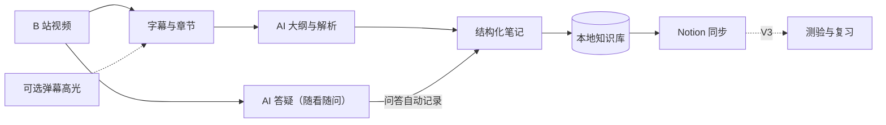
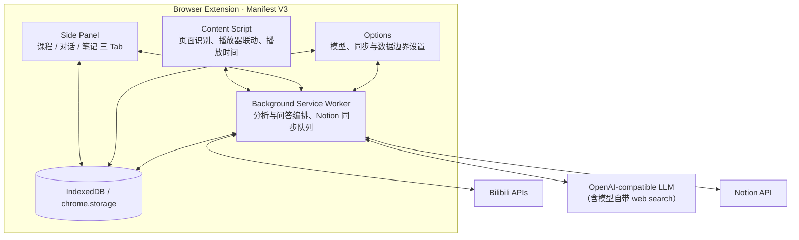

<div align="center">


# BiliNote

### 把 B 站视频变成可检索、可回看、可复习的知识笔记

面向视频学习场景的开源 AI 浏览器扩展。提取视频上下文，调用你选择的模型，沉淀属于自己的知识库。

[](#项目状态)
[](LICENSE)
[](#技术栈)
[](#技术栈)
[](https://github.com/AliceDel66/BiliNote/stargazers)

[功能进度](#功能进度) · [参与开发](#参与开发) · [架构设计](#架构设计) · [隐私与权限](#隐私与权限) · [路线图](#路线图) · [English](#english-summary)

[提交问题](https://github.com/AliceDel66/BiliNote/issues/new) · [查看 Issues](https://github.com/AliceDel66/BiliNote/issues) · [参与贡献](#贡献指南)

</div>

> [!IMPORTANT]
> BiliNote 仍处于 **pre-alpha** 阶段，但主链路已全部落地并可日常使用：**视频识别 → 字幕分析 → 时间戳跳转 → 本地笔记 → Notion 同步**，以及 **三 Tab 侧边栏（课程 / 对话 / 笔记）+ AI 随看随问 + 模型自带联网搜索 + 数据边界控制**。当前重点是真实浏览器全链路回归与发布准备。仓库适合开发者试用，尚无面向普通用户的稳定安装包。

## 为什么做 BiliNote

在 B 站学习，难点往往不在“看完”，而在“留下来”：

- 长视频缺少可检索结构，重点难以再次定位；
- 手动摘录频繁打断观看，笔记还会散落在不同工具；
- 通用 AI 不知道当前视频和播放进度，需要反复补充上下文；
- 封闭工具容易绑定模型、托管数据，也难以审计真实行为。

BiliNote 希望建立一条透明、可控的学习链路：

> **视频上下文 → AI 理解 → 结构化笔记 → 知识库同步 → 持续复习**

## 它如何工作



| 核心能力 | 用户价值 |
| :--- | :--- |
| **理解视频** | 从字幕、分 P 与章节中提炼大纲、摘要、难点、拓展知识与注意事项 |
| **定位原文** | 为知识点保留时间戳，点击即可回到对应画面 |
| **随看随问** | 不离开视频页提问；AI 结合当前分 P、播放时间与课程内容回答，并自动沉淀进笔记 |
| **自由选模型** | 通过 BYOK 与 OpenAI-compatible API 接入自己的模型服务，联网搜索直接用模型自带能力 |
| **拥有知识** | 本地保存笔记与会话，并按课程与章节同步到个人知识库 |

## 项目状态

### 当前实现

| 模块 | 状态 | 当前范围 |
| :--- | :---: | :--- |
| WXT / Manifest V3 工程配置 | 已实现 | React、TypeScript strict、Tailwind CSS v4、pnpm |
| Bilibili Adapter | 已实现 | 视频/分 P 信息、WBI 签名、字幕轨选择、字幕归一化、24 小时缓存、弹幕采样 |
| OpenAI-compatible Client | 已实现 | 多 Profile、模型列表、连通性测试、SSE 流式对话、tools 透传、统一错误 |
| Summarization Pipeline | 已实现 | 并发 Map-Reduce、流式进度、取消、结果缓存、时间戳校验、JSON 修复与降级、拓展知识 / 注意事项 |
| Extension Runtime | 已实现 | Content Script 识别 SPA 路由；首开标签页自动补注入 + URL 兜底；Background 统一编排 Bilibili / LLM / Notion / Chat |
| Side Panel | 已实现 | 三 Tab（课程 / 对话 / 笔记）、CourseContextBar 吸顶、视频卡、一键分析、时间戳 pill、设计系统 v2 明暗双主题 |
| AI Chat 答疑 | 已实现 | 播放快照（≤1s）、±60s 字幕上下文预算、完整度三态降级、注入防护、思考过程剥离、会话/话题/轮次持久化 |
| 问答自动记录 | 已实现 | 完整回答后幂等写入当前分 P 笔记（chatEntryId 边界标记）、撤销 / 不记录 / 重新记录、15s 合并同步 |
| Web Search（模型自带） | 已实现 | Kimi `$web_search` 能力表、未知提供商按不支持处理、强制联网硬报错、自动拓展降级提示 |
| 数据边界 | 已实现 | 最小暴露默认；设置页逐源开关（字幕窗口 / 笔记摘录 / 播放元信息），关闭字幕即课程内容不出本地 |
| Local Notes | 已实现 | 元信息头（含原视频链接）、AI 结果转 Markdown、1 秒防抖自动保存、预览、删除、最近 10 版历史 |
| Notion Sync | 已实现（实号已验证） | 内部集成令牌、根页面选择、课程 / `P{n} · 章节` 页面树与自动改名、自动/手动同步、冲突检测、限流重试 |
| Options / Data | 已实现 | 模型 / Notion / 数据边界设置、弹幕与自动记录开关、数据导出（含问答会话，不含密钥令牌）、二次确认清空 |
| Browser E2E / Release | 进行中 | 字幕 CDN 权限、视频识别、Notion 实号同步已回归；最新 UI 真机截图回归持续进行，暂无 release 包 |

> [!NOTE]
> “已实现”表示主路径代码已落地并经单测/真机构建验证，不等于已发布。Notion 当前使用手动创建的 **Internal Integration Token**，不是 OAuth；同步更新采用“归档原有子块后重写整页”，不是逐块增量 diff。

### 当前验证基线

| 检查 | 当前结果 |
| :--- | :--- |
| `pnpm compile` | WXT 类型生成与 TypeScript strict 检查通过 |
| `pnpm test` | 17 个测试文件、145 项测试通过 |
| `pnpm build` | Chrome MV3 构建成功，产物位于 `.output/chrome-mv3` |
| 真实扩展回归 | 已验证 Bilibili 视频信息、字幕 CDN 权限、一键分析、Notion 实号同步；三 Tab 与 AI 答疑经真机截图回归 |

验证数字对应当前开发快照，后续提交以本地实际命令输出和 CI 为准。

## 功能进度

### MVP · 打通学习闭环（已完成）

- [x] WXT + React + TypeScript 基础工程
- [x] B 站视频信息、WBI 签名与字幕获取基础模块
- [x] OpenAI-compatible 模型客户端基础模块
- [x] IndexedDB 与模型配置存储基础模块
- [x] Background API 编排与分析端口
- [x] Content Script 视频上下文识别（含首开补注入与 URL 兜底）
- [x] 长字幕 Map-Reduce 总结管线集成
- [x] Side Panel 大纲、总结、流式进度与时间戳跳转
- [x] 弹幕按分钟采样并作为可选分析上下文
- [x] Markdown 笔记编辑、预览、自动保存与版本数据
- [x] Notion 内部集成令牌、页面树同步与冲突保护
- [x] 模型 / Notion 设置与本地数据导出、清空
- [x] 拓展知识与注意事项完整接入（管线 / UI / 笔记 / 测试）
- [x] 笔记元信息头（视频标题、分 P、UP 主、原视频链接、生成时间）

### M4 · AI 答疑与学习辅导（已上线）

- [x] 三 Tab 侧边栏：课程 / 对话 / 笔记 + CourseContextBar 置顶
- [x] 播放快照、±60s 字幕窗口、上下文预算与完整度三态降级
- [x] 回答结构（直接回答 / 分步解释 / 课程关系锚点 / 事实推断标注）与思考过程剥离
- [x] 问答自动记录：幂等写入、边界标记、撤销 / 重新记录、会话持久化防重复
- [x] 模型自带联网搜索（能力表驱动，不支持时明确提示 / 硬报错）
- [x] 数据边界逐源开关（字幕 / 笔记摘录 / 播放元信息）
- [x] 设计系统 v2：Lucide 图标、时间戳 pill、明暗双主题、吸顶三区

### 后续版本

- **V2 续 · 理解效率**：知识点测验、任务级模型路由、AI 扩写与润色、网页剪藏、学习统计、全量笔记库与模板；
- **V3 · 长期记忆**：间隔重复、Anki 导出、语义搜索、知识图谱、学习周报、多站点适配与 MCP 知识源接入。

## 参与开发

> [!WARNING]
> 当前没有面向普通用户的安装包。以下命令用于贡献者开发，不能视为稳定安装指南。

建议环境：Node.js 20+、pnpm 9+、Chrome 或 Edge。

```bash
git clone https://github.com/AliceDel66/BiliNote.git
cd BiliNote
pnpm install

pnpm compile   # 生成 WXT 类型并运行 TypeScript 检查
pnpm test      # 运行 Vitest
pnpm dev       # 启动 WXT 开发模式
pnpm build     # 构建扩展
pnpm zip       # 生成分发包
pnpm verify:bili # 联网检查 Bilibili 视频信息 / 字幕接口
```

### 本地加载与试用

1. 运行 `pnpm build`；
2. 打开 `chrome://extensions`，启用“开发者模式”；
3. 点击“加载已解压的扩展程序”，选择 `.output/chrome-mv3`；
4. 打开扩展设置页，新增 `baseURL + API Key + 默认模型`，先执行“拉取模型列表”或“测试连接”；
5. 打开有可用字幕的 Bilibili 视频页，点击扩展图标打开 Side Panel，再执行“一键分析”；
6. （可选）在「对话」Tab 随看随问；在设置页粘贴 Notion 内部集成令牌并选择根页面，即可自动同步笔记。

使用 `pnpm dev` 时加载 `.output/chrome-mv3-dev`。自定义模型端点会按域名请求可选 Host Permission；请只授权你信任的服务。Bilibili 登录状态、视频字幕开放情况和模型服务可用性都会影响结果。

## 架构设计



### 技术栈

| 层 | 选型 | 用途 |
| :--- | :--- | :--- |
| 扩展框架 | WXT · Manifest V3 | 入口、构建与浏览器扩展能力 |
| 前端 | React 18 · TypeScript · Tailwind CSS v4 | Side Panel 与设置界面 |
| 图标 | Lucide（inline SVG 组件） | 全界面图标体系 |
| Markdown | marked · DOMPurify | 笔记预览与 AI 输出安全渲染 |
| 视频适配 | Bilibili Web APIs（非官方）· WBI | 视频信息、字幕与章节上下文 |
| 模型层 | OpenAI Chat Completions compatible API · SSE · tools | 多模型接入、流式生成与模型自带联网 |
| 本地数据 | IndexedDB（Dexie）· `chrome.storage` | 笔记、会话、缓存、密钥与偏好 |
| 知识库 | Notion API · Internal Integration Token | Markdown 转 blocks、页面树、整页替换与冲突保护 |
| 工程化 | pnpm · WXT/Vite · Vitest · fake-indexeddb | 开发、构建、测试与打包 |

### 当前目录

```text
BiliNote/
├── entrypoints/
│   ├── background.ts       # 消息路由、分析/问答编排、Notion 同步队列
│   ├── content.ts          # 视频上下文、播放器跳转与播放时间
│   ├── sidepanel/          # 三 Tab 主界面 + ChatView 答疑视图
│   └── options/            # 模型、Notion、数据边界、偏好与数据管理
├── components/             # ui 原语、Lucide 图标、Tabs、Markdown 预览、时间戳 pill
├── lib/
│   ├── bilibili/           # 视频信息、WBI、字幕、弹幕与 URL 解析
│   ├── chat/               # 上下文、Prompt、问答写笔记、会话存储、联网能力
│   ├── llm/                # OpenAI-compatible Client（SSE · tools）
│   ├── notion/             # Notion Client、Markdown 转换与同步
│   ├── storage/            # IndexedDB、模型与 Notion 配置
│   └── summarize/          # 分块、Prompt、校验与结果转换
├── test/                   # Vitest 单元与协议回归测试
├── scripts/                # 联网验证脚本
├── package.json            # 开发、测试、构建与打包命令
├── wxt.config.ts           # Manifest V3 与权限配置
├── tsconfig.json           # TypeScript strict 配置
└── README.md
```

运行时边界：页面识别与播放器操作留在 Content Script；跨域请求和长任务留在 Background Service Worker；Side Panel 与 Options 直接读写本地数据，并通过消息协议调用 Background。

## 隐私与权限

BiliNote 以 **Local-first、BYOK、最小权限、可审计** 为设计约束。

| 权限或数据 | 用途 | 边界 |
| :--- | :--- | :--- |
| `storage` | 保存模型配置、偏好、字幕缓存与笔记 | API Key 仅进入 `chrome.storage.local` |
| `sidePanel` | 提供不打断视频的学习界面 | 不修改视频页面主体布局 |
| `scripting` | 为扩展安装/重载前已打开的标签页补注入 Content Script | 仅用于恢复视频识别能力 |
| `*://*.bilibili.com/*` | 获取当前用户可访问的视频信息与字幕 | 不做批量抓取或视频下载 |
| `*://*.hdslb.com/*` | 获取 Bilibili 实际返回的字幕 CDN JSON | 仅用于字幕资源；已有权限回归测试 |
| 可选 `*://*/*` | 连接用户主动配置的模型与 Notion 服务 | 应在需要时单独授权，不作为默认数据出口 |

- 当前代码未引入遥测或广告依赖；
- 字幕仅应发送到用户自己配置的模型端点；答疑上下文另有「数据边界」逐源开关（字幕窗口 / 笔记摘录 / 播放元信息）；
- AI 回答使用课程上下文时以明确标记包裹不可信数据，防止提示注入；模型思考过程不入库；
- AI Markdown 输出经 DOMPurify 清洗后渲染；
- API Key 与 Notion Token 保存在 `chrome.storage.local`，数据导出会主动排除两者；
- 权限、网络行为与发布包将在首个 release 前单独审计。

## 路线图

| 里程碑 | 状态 | 完成标准 |
| :--- | :---: | :--- |
| **M0 · Blueprint** | 已完成 | 产品边界、架构和路线图明确 |
| **M1 · Foundation** | 已完成 | 可运行扩展骨架、核心模块、测试与构建可用 |
| **M2 · MVP** | 已完成 | 分析 → 笔记主链路落地，拓展知识 / 注意事项与元信息头齐备 |
| **M3 · Sync** | 已完成 | Internal Integration 页面树同步、冲突保护、实号回归通过；OAuth 后置 |
| **M4 · Learning** | 进行中 | 三 Tab + AI 答疑 + 联网搜索 + 数据边界已上线；测验、复习与多站点待做 |

## 贡献指南

BiliNote 欢迎 Bug 报告、功能讨论、文档改进与代码贡献。

1. 提交较大改动前，先创建 [Issue](https://github.com/AliceDel66/BiliNote/issues/new) 说明问题、目标与边界；
2. Fork 仓库，从 `main` 创建小而清晰的功能分支；
3. 保持改动聚焦，新增核心逻辑时同步补充测试；
4. 提交 PR 前运行 `pnpm compile` 与 `pnpm test`；
5. PR 中写明动机、实际变化、验证结果和已知限制。

优先贡献方向：Bilibili Adapter 稳定性、Prompt 评测、知识点测验、MCP 知识源 Profile、无障碍体验、测试覆盖与文档。

## English summary

<details>
<summary><strong>Read the English overview</strong></summary>

### Turn Bilibili videos into searchable, reviewable knowledge

BiliNote is an early-stage, open-source browser extension for focused video learning. It extracts Bilibili subtitles and optional danmaku context, generates structured notes with a user-selected AI model, preserves timestamp links, stores notes and chat sessions locally, and syncs them to Notion.

**Status:** pre-alpha. The full loop is implemented: video detection → subtitle analysis → timestamped notes → Notion sync, plus a three-tab side panel (Course / Chat / Notes) with AI Q&A that understands your current playback position, model-native web search (e.g. Kimi `$web_search`), and per-source privacy controls. Notion currently uses a manually configured Internal Integration Token rather than OAuth. No stable end-user release is available yet.

#### Principles

- **Local-first:** learning data stays in the browser by default.
- **BYOK:** users choose and configure their own model provider.
- **Model-agnostic:** the model layer targets OpenAI-compatible APIs.
- **Privacy-controlled:** minimal context exposure by default, with per-source switches for what may be sent to the model.
- **Open and auditable:** permissions, network behavior, and data flows remain inspectable.

Contributions are welcome. See [Development](#参与开发), [Roadmap](#路线图), and [Contributing](#贡献指南).

</details>

## License

BiliNote is released under the [MIT License](LICENSE).

> BiliNote 是独立社区开源项目，与哔哩哔哩、Notion 及任何模型供应商不存在官方隶属或背书关系。相关商标归各自权利人所有。

---

<div align="center">

如果这个方向对你有价值，欢迎点亮 Star、提交 Issue 或参与实现。

**让“看过”变成“理解过、记录过、还能找回来”。**

</div>
